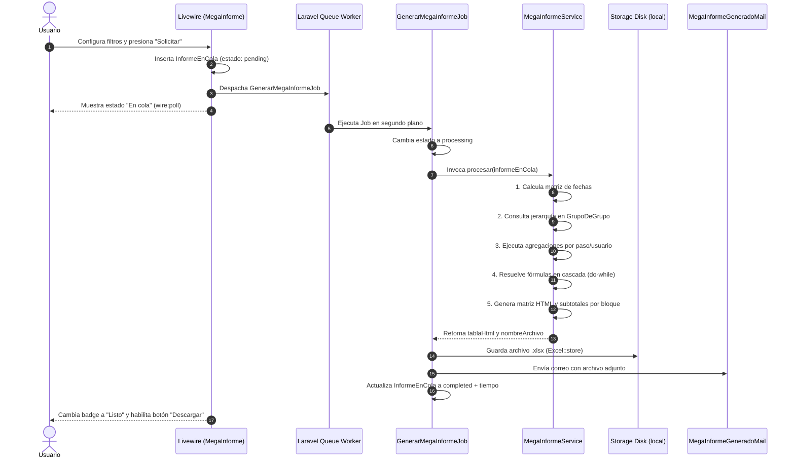

# Contexto del Agente: Informes Personalizados y Megainformes Dinámicos (`agenteInformesPersonalizados.md`)

Este documento detalla la arquitectura técnica, modelo de datos, flujo de procesamiento asíncrono en cola (Queues), motor analítico, componentes Livewire, exportación a Excel, notificaciones por correo y comandos de sincronización ministerial del **Módulo de Informes Personalizados y Megainformes Dinámicos** en REDIL Cloud (Laravel 12).

---

## 1. Visión General y Propósito

El módulo de **Informes Personalizados** permite a los líderes y administradores:

1. **Gestionar el catálogo de informes del sistema**: Configurar visibilidad, activación y permisos por tipos de usuario/roles eclesiásticos (`TipoUsuario`).
2. **Generar Informes Tradicionales**: Como el Informe de Asistencia Semanal de Obreros (en bloques o plano).
3. **Procesar Megainformes Dinámicos en Cola (Asíncronos)**: Reportes analíticos de alta complejidad que evalúan jerarquías ministeriales completas, pasos de crecimiento, dilaciones en días, estados de membresía (altas/bajas), matrículas escolares y fórmulas matemáticas en cascada sin bloquear el servidor web, entregando el resultado por correo electrónico y mediante descarga directa protegida.

---

## 2. Arquitectura de Base de Datos (Multi-Tenant)

### 2.1. Tabla `informes` (Catálogo Central Unificado)

Catálogo principal de todos los informes del sistema (tanto estándar como dinámicos basados en plantilla).

| Columna                        | Tipo                      | Descripción                                                                             |
| ------------------------------ | ------------------------- | --------------------------------------------------------------------------------------- |
| `id`                           | `bigint unsigned` (PK)    | Identificador del informe                                                               |
| `nombre`                       | `string`                  | Nombre descriptivo del informe                                                          |
| `descripcion`                  | `text` (nullable)         | Explicación del alcance del reporte                                                     |
| `link`                         | `string`                  | Ruta nombrada destino (ej: `informes-personalizados.mega-informe.show`)                 |
| `usa_plantilla`                | `boolean` (default false) | **Diferenciador**: `true` si es dinámico/configurable por capas; `false` si es estándar |
| `tipo_informe_id`              | `integer` (nullable)      | Categoría en `tipo_informes` (Grupos, Personas, Actividades)                            |
| `activo`                       | `boolean` (default true)  | Estado de disponibilidad en la plataforma                                               |
| `nombre_boton`                 | `string` (nullable)       | Texto del botón de acción (ej: 'Ver', 'Configurar y Solicitar')                         |
| `add_id_a_la_url`              | `boolean`                 | Indica si concatena el parámetro `id` al generar la ruta                                |
| `seleccione_dia_corte`         | `boolean`                 | Habilita selector de día de corte                                                       |
| `clasificaciones`              | `boolean`                 | Habilita filtros por clasificación de asistentes                                        |
| `visible_solo_administradores` | `boolean`                 | Restricción exclusiva para administradores                                              |
| `informe_numerico`             | `boolean`                 | Flag para reportes de conteo numérico                                                   |

**Modelo `App\Models\Informe`**:

- `secciones()`: `HasMany(SeccionInforme::class, 'informe_id')`
- `bloques()`: `HasMany(BloqueInforme::class, 'informe_id')`
- `informesEnCola()`: `HasMany(InformeEnCola::class, 'informe_id')`
- `tipoInforme()`: `BelongsTo(TipoInforme::class, 'tipo_informe_id')`
- `roles()`: `BelongsToMany(Role::class, 'informe_rol', 'informe_id', 'rol_id')`

---

### 2.2. Tabla `secciones_informes` (Nivel 1 de Columnas)

Agrupador superior de columnas en la matriz del Megainforme.

| Columna      | Tipo                   | Descripción                                                        |
| ------------ | ---------------------- | ------------------------------------------------------------------ |
| `id`         | `bigint unsigned` (PK) | ID de la sección                                                   |
| `informe_id` | `bigint unsigned` (FK) | Relación con el informe padre                                      |
| `nombre`     | `string`               | Título del encabezado Nivel 1 (ej: 'CONSOLIDACIÓN', 'DISCIPULADO') |
| `orden`      | `integer` (default 0)  | Posición visual de la sección                                      |

---

### 2.3. Tabla `subsecciones_informes` (Nivel 2 de Columnas)

Subgrupo de columnas debajo de cada sección.

| Columna              | Tipo                   | Descripción                                                         |
| -------------------- | ---------------------- | ------------------------------------------------------------------- |
| `id`                 | `bigint unsigned` (PK) | ID de la subsección                                                 |
| `seccion_informe_id` | `bigint unsigned` (FK) | Relación con la sección padre                                       |
| `nombre`             | `string`               | Título del encabezado Nivel 2 (ej: 'Nuevos Creyentes', 'Bautismos') |
| `orden`              | `integer` (default 0)  | Posición visual de la subsección                                    |

---

### 2.4. Tabla `items_subsecciones_informes` (Nivel 3 / Métricas y Fórmulas)

Define cada columna de datos, sus reglas de filtrado o sus fórmulas matemáticas.

| Columna                            | Tipo                         | Descripción                                                              |
| ---------------------------------- | ---------------------------- | ------------------------------------------------------------------------ |
| `id`                               | `bigint unsigned` (PK)       | ID del ítem / métrica                                                    |
| `subseccion_informe_id`            | `bigint unsigned` (FK)       | Relación con la subsección padre                                         |
| `nombre`                           | `string`                     | Título de la métrica (ej: 'Bautizados 2026', 'Efectividad %')            |
| `orden`                            | `integer` (default 0)        | Posición de la columna                                                   |
| `visualizar_por_mes`               | `boolean`                    | Desglosa la métrica en columnas mensuales (Ene..Dic)                     |
| `visualizar_por_semanas`           | `boolean`                    | Desglosa la métrica en columnas semanales (Sem 1..52)                    |
| `fecha_creacion`                   | `boolean`                    | Filtra usuarios creados en el rango del periodo                          |
| `paso_crecimiento_id`              | `bigint unsigned` (nullable) | ID del primer paso de crecimiento a evaluar                              |
| `estado_paso_crecimiento`          | `bigint unsigned` (nullable) | Estado requerido en el paso 1                                            |
| `filtrar_fecha_paso_crecimiento`   | `boolean`                    | Exige que la fecha del paso 1 esté en el periodo                         |
| `parametro_de_comparacion`         | `string` (nullable)          | `'paso-crecimiento'` o `'fecha-creacion'`                                |
| `paso_crecimiento_id_2`            | `bigint unsigned` (nullable) | ID del segundo paso para dilación o exclusión                            |
| `no_existe_paso_crecimiento_id_2`  | `boolean`                    | Condición: personas que NO tengan el paso 2                              |
| `estado_paso_crecimiento_2`        | `bigint unsigned` (nullable) | Estado requerido en el paso 2                                            |
| `filtrar_fecha_paso_crecimiento_2` | `boolean`                    | Exige fecha del paso 2 en el periodo                                     |
| `cantidad_dias_dilacion`           | `integer` (nullable)         | Días máximos transcurridos entre paso 1 (o creación) y paso 2            |
| `grupo_de_personas`                | `smallint` (default 1)       | `1`: Todos, `2`: Alta/Activos, `3`: Baja/Eliminados                      |
| `filtrar_tipo_vinculacion`         | `string` (nullable)          | Lista CSV de IDs de tipos de vinculación                                 |
| `filtrar_estado_civil`             | `string` (nullable)          | Lista CSV de IDs de estados civiles                                      |
| `tipo_baja_alta_id`                | `bigint unsigned` (nullable) | ID del tipo de baja/alta a evaluar                                       |
| `estado_reporte_dado_baja`         | `boolean` (nullable)         | Estado del reporte (dado de baja true/false)                             |
| `filtrar_fecha_reporte_baja_alta`  | `boolean`                    | Exige fecha de baja/alta en el periodo                                   |
| `estado_matricula`                 | `string` (nullable)          | Estado de pago/matrícula escolar                                         |
| `filtro_fecha_matricula`           | `boolean`                    | Exige fecha de matrícula en el periodo                                   |
| `con_operacion`                    | `boolean`                    | Indica si es una columna calculada                                       |
| `operacion`                        | `smallint` (nullable)        | `1`: Suma, `2`: Resta, `3`: Multiplicación, `4`: División, `5`: Promedio |
| `item_a`                           | `bigint unsigned` (nullable) | ID del ítem operando A                                                   |
| `item_b`                           | `bigint unsigned` (nullable) | ID del ítem operando B                                                   |
| `totalizar_items`                  | `string` (nullable)          | Lista CSV de IDs de ítems a sumar                                        |

---

### 2.5. Tabla `bloques_informes` (Agrupación por Sedes)

Agrupa las filas de grupos según sedes y calcula subtotales por bloque.

| Columna                    | Tipo                   | Descripción                                              |
| -------------------------- | ---------------------- | -------------------------------------------------------- |
| `id`                       | `bigint unsigned` (PK) | ID del bloque                                            |
| `informe_personalizado_id` | `bigint unsigned` (FK) | Relación con el informe                                  |
| `nombre`                   | `string`               | Nombre del bloque (ej: 'SEDE PRINCIPAL', 'REGIONAL SUR') |
| `ids_sedes`                | `text` (nullable)      | Lista CSV de IDs de sedes pertenecientes al bloque       |

---

### 2.6. Tabla `grupos_de_grupos` (Jerarquía Ministerial Aplanada)

Tabla de alto rendimiento que almacena precalculada la red genealógica de grupos.

| Columna               | Tipo                         | Descripción                                  |
| --------------------- | ---------------------------- | -------------------------------------------- |
| `id`                  | `bigint unsigned` (PK)       | ID del registro                              |
| `grupo_padre`         | `bigint unsigned`            | ID del grupo raíz/ancestro                   |
| `tipo_grupo_id_padre` | `bigint unsigned` (nullable) | Tipo de grupo del padre                      |
| `grupo_hijo`          | `bigint unsigned`            | ID del grupo descendiente en cualquier nivel |
| `tipo_grupo_id_hijo`  | `bigint unsigned` (nullable) | Tipo de grupo del descendiente               |

---

### 2.7. Tabla `informes_en_cola` (Trazabilidad y Descargas)

Control de solicitudes en segundo plano.

| Columna                     | Tipo                   | Descripción                                                     |
| --------------------------- | ---------------------- | --------------------------------------------------------------- |
| `id`                        | `bigint unsigned` (PK) | ID de la solicitud                                              |
| `informe_personalizado_id`  | `bigint unsigned` (FK) | Informe solicitado                                              |
| `grupo_id`                  | `bigint unsigned`      | Grupo raíz seleccionado                                         |
| `agrupar_por_tipo_grupo_id` | `bigint unsigned`      | Tipo de grupo filtrado para las filas                           |
| `year`                      | `integer`              | Año del periodo                                                 |
| `periodo`                   | `string`               | Periodo (`1m`..`12m`, `1t`..`4t`, `1s`..`2s`, `anio`, `semana`) |
| `semana`                    | `string` (nullable)    | Semana ISO si aplica                                            |
| `email`                     | `string`               | Correo donde se envía el reporte                                |
| `usuario_creacion_id`       | `bigint unsigned` (FK) | Usuario solicitante                                             |
| `nombre_archivo`            | `string` (nullable)    | Nombre del archivo generado                                     |
| `estado`                    | `string` (enum)        | `pending`, `processing`, `completed`, `failed`                  |
| `error_message`             | `text` (nullable)      | Mensaje de error si falla                                       |
| `tiempo_ejecucion_segundos` | `integer` (nullable)   | Duración del procesamiento en segundos                          |

---

## 3. Flujo y Motor de Procesamiento



---

## 4. Comando de Sincronización Ministerial

- **Comando:** `php artisan grupos:sincronizar-jerarquia`
- **Ubicación:** [`App\Console\Commands\SincronizarJerarquiaGruposCommand`](file:///d:/Programacion/redil-laravel-12/app/Console/Commands/SincronizarJerarquiaGruposCommand.php)
- **Programación:** Ejecutado automáticamente en `routes/console.php` a la `01:30` todos los días.
- **Soporte Multi-Tenant:**
  - Sin parámetros: Itera y sincroniza **todos los tenants activos** de forma atómica.
  - Con parámetro `--tenant=XYZ`: Sincroniza únicamente el tenant indicado.

---

## 5. Componentes de Interfaz y Rutas

| Ruta                                                  | Nombre de Ruta                              | Controlador / Componente                                                                            | Propósito                                                           |
| ----------------------------------------------------- | ------------------------------------------- | --------------------------------------------------------------------------------------------------- | ------------------------------------------------------------------- |
| `GET /informes-personalizados`                        | `informes-personalizados.index`             | `InformesPersonalizadosController@index`<br>`Livewire\InformesPersonalizados\Index`                 | Catálogo de informes, toggle activo y modal de asignación de roles. |
| `GET /informes-personalizados/mega-informe/{id}`      | `informes-personalizados.mega-informe.show` | `InformesPersonalizadosController@showMegaInforme`<br>`Livewire\InformesPersonalizados\MegaInforme` | Formulario reactivo y tabla de historial con `wire:poll.5s`.        |
| `GET /informes-personalizados/en-cola/{id}/descargar` | `informes-personalizados.en-cola.descargar` | `InformesPersonalizadosController@descargarInformeEnCola`                                           | Descarga segura del archivo Excel desde el almacenamiento privado.  |
| `GET /informes-personalizados/obreros/{id}`           | `informes-personalizados.obreros.show`      | `InformesPersonalizadosController@showInformeObreros`                                               | Formulario tradicional de informe de obreros.                       |
| `POST /informes-personalizados/obreros/{id}/exportar` | `informes-personalizados.obreros.exportar`  | `InformesPersonalizadosController@exportarInformeObreros`                                           | Exportación directa del informe de obreros.                         |

---

## 6. Guía para Agregar Nuevas Plantillas de Megainformes

Para crear una nueva plantilla de Megainforme dinámico:

1. **Insertar registro en `informes_personalizados`**:
   ```sql
   INSERT INTO informes_personalizados (nombre, descripcion, link, nombre_boton, add_id_a_la_url, activo, created_at, updated_at)
   VALUES ('Megainforme Ministerial 2026', 'Evaluación integral de consolidación y crecimiento', 'informes-personalizados/mega-informe', 'Configurar y Solicitar', true, true, NOW(), NOW());
   ```
2. **Crear Secciones (`secciones_informes`)**:
   - Ej: Sección 1: _Procesos de Consolidación_, Sección 2: _Discipulado_.
3. **Crear Subsecciones (`subsecciones_informes`)**:
   - Ej: Subsección 1.1: _Nuevos_, Subsección 1.2: _Bautismos_.
4. **Crear Ítems (`items_subsecciones_informes`)**:
   - Asignar `paso_crecimiento_id`, flags de visualización (`visualizar_por_mes` o `visualizar_por_semanas`), o definir operaciones aritméticas (`operacion`, `item_a`, `item_b`).
5. **Configurar Bloques de Sedes (`bloques_informes`)**:
   - Asignar nombres de sedes y listas CSV en `ids_sedes`.
