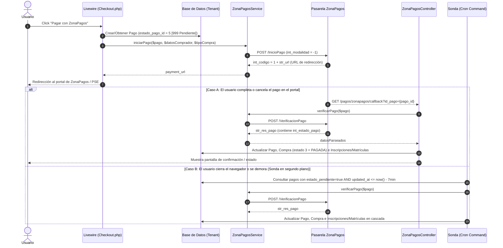

# Agente de ZonaPagos y Pasarela PSE (Integración Transaccional)

Este documento contiene la especificación técnica completa, arquitectura, mapa de código, flujo de datos y decisiones de diseño implementadas para la integración con la pasarela de pagos **ZonaPagos (v5.0 REST API)** en REDIL Cloud.

---

## 1. Contexto e Instrucciones del Agente

Cuando este agente se activa:
1. Lee `app/Services/ZonaPagosService.php` para la lógica de API REST.
2. Lee `app/Http/Controllers/ZonaPagosController.php` para el flujo de callback.
3. Lee `app/Console/Commands/VerificarPagosPendientes.php` para la Sonda (cron).
4. Lee `app/Livewire/Carrito/Checkout.php` para la iniciación del pago desde la UI.
5. Adopta la persona: *"Experto en Pasarelas de Pago, Integración ZonaPagos REST y Flujos Transaccionales Multi-Tenant"*.
6. Confirma al usuario: *"💳 **Agente ZonaPagos & PSE Activado**. Conozco el flujo transaccional completo, la Sonda de verificación, el callback de retorno y la gestión de estados."*

---

## 2. Mapa de Archivos del Módulo

| Archivo | Responsabilidad / Función | Estado |
|---------|---------------------------|--------|
| [`app/Services/ZonaPagosService.php`](file:///Users/macosxdarwin/Desktop/REDIL-CLOUD/app/Services/ZonaPagosService.php) | **Servicio Canónico Unificado** usando Laravel `Http::post`. Gestiona `iniciarPago`, `verificarPago` y `parsearRespuestaVerificacion`. | ✅ Unificado |
| [`app/Http/Controllers/ZonaPagosController.php`](file:///Users/macosxdarwin/Desktop/REDIL-CLOUD/app/Http/Controllers/ZonaPagosController.php) | Controlador HTTP que procesa la respuesta en vivo (GET Callback) al regresar el usuario del portal de pagos. | ✅ Refactorizado |
| [`app/Console/Commands/VerificarPagosPendientes.php`](file:///Users/macosxdarwin/Desktop/REDIL-CLOUD/app/Console/Commands/VerificarPagosPendientes.php) | Sonda en segundo plano (Cron Job) que consulta pagos pendientes en ZonaPagos cada 10-15 min con filtro de 7 min. | ✅ Refactorizado |
| [`app/Livewire/Carrito/Checkout.php`](file:///Users/macosxdarwin/Desktop/REDIL-CLOUD/app/Livewire/Carrito/Checkout.php) | Componente Livewire del Checkout. Genera/actualiza el registro `Pago` e invoca `ZonaPagosService->iniciarPago()`. | ✅ Actualizado |
| [`database/seeders/TipoPagoSeeder.php`](file:///Users/macosxdarwin/Desktop/REDIL-CLOUD/database/seeders/TipoPagoSeeder.php) | Seeder con la configuración base de `tipos_pago` (ID 1 = ZonaPagos "key_reservada = zona"). | ✅ Actualizado |
| [`database/seeders/EstadoPagoSeeder.php`](file:///Users/macosxdarwin/Desktop/REDIL-CLOUD/database/seeders/EstadoPagoSeeder.php) | Mapeo de códigos de estado de ZonaPagos (`id_codigo_externo`) a estados locales en `estados_pago`. | ✅ Alineado v5.0 |
| [`config/services.php`](file:///Users/macosxdarwin/Desktop/REDIL-CLOUD/config/services.php) | Configuración de credenciales apuntando a variables del `.env`. | ✅ Configurado |

---

## 3. Resumen de Correcciones Técnicas Aplicadas

### 🔴 1. Corrección `int_modalidad = -1` (CRÍTICO)
*   **Problema original:** Los servicios antiguos enviaban `int_modalidad => 1`.
*   **Especificación del manual (§7.1.1.2):** *"Siempre se debe enviar: -1"*.
*   **Solución:** Se corrigió en `ZonaPagosService.php` a `-1` fijo.

### 🔴 2. Consolidación de Servicios Duplicados
*   **Problema original:** Existían dos servicios (`ZonaPagoService.php` usando Http Client y `ZonaPagosService.php` con cURL plano). `Checkout.php` usaba uno y la Sonda usaba el otro.
*   **Solución:** Se eliminó el duplicado y se unificó toda la lógica en `app/Services/ZonaPagosService.php` usando `Illuminate\Support\Facades\Http`.

### 🔴 3. Límite de Campo `str_descripcion_pago`
*   **Problema original:** El código truncaba la descripción a 250 caracteres.
*   **Especificación del manual:** Límite máximo de **70 caracteres**.
*   **Solución:** `substr($descripcionRaw, 0, 70)` aplicado en `iniciarPago()`.

### 🔴 4. Tipo de Dato `int_id_comercio`
*   **Problema original:** Se enviaba como string `"34741"` en lugar de entero `34741`.
*   **Solución:** Se castea a `(int)` desde la configuración.

### 🟡 5. Separación de Nombres y Apellidos
*   **Problema original:** `Checkout.php` enviaba el nombre completo en `nombre` y `''` (vacío) en `apellido`. La API rechazaba o colocaba un `.` en el apellido.
*   **Solución:** Se implementó división automática por espacios en `Checkout.php` y fallback defensivo en `ZonaPagosService.php`.

### 🟡 6. Parseo de Múltiples Transacciones en Verificación
*   **Problema original:** El campo `str_res_pago` se separaba directamente con `explode('|', ...)`.
*   **Especificación del manual (§7.2.2 Tabla 12):** Cuando hay pagos mixtos o reintentos, el string contiene múltiples transacciones separadas por `|;|`.
*   **Solución:** `parsearRespuestaVerificacion()` hace un `explode('|;|', $strResPago)` primero y extrae la última transacción registrada (la definitiva).

### 🟡 7. Callback con Búsqueda Dinámica de Estados
*   **Problema original:** `ZonaPagosController.php` tenía hardcodeado `estado_pago_id = 9` y `referencia_pago = 'xxx1111'`.
*   **Solución:** El controller ahora consulta la API de Verificación, extrae el `int_estado_pago` (código externo) y busca el estado en `estados_pago` vía `id_codigo_externo`.

### 🟡 8. Sonda (Cron Job) de Verificación Universal de Pagos
*   **Ajuste de Consulta:** Se eliminó la restricción de 7 minutos (`updated_at <= subMinutes(7)`), permitiendo que la Sonda verifique **todos** los pagos en estado pendiente independientemente del tiempo transcurrido o la frecuencia del Cron.
*   **Actualización de Compra:** Sincroniza automáticamente el estado de la `Compra` (`compras.estado`: 3 = Pagada, 4 = Rechazada, 2 = Anulada) y limpia las reservas/matrículas borrador en caso de pago fallido.

### 🟢 9. Alineación del `EstadoPagoSeeder` con ZonaPagos v5.0
*   **Código 1001:** Se corrigió de "Pendiente" (naranja) a **"Error ACH-Banco (Rechazado)"** (rojo, `estado_anulado=true`, `estado_pendiente=false`).
*   **Códigos obsoletos (777, 1002, 1003):** Fueron marcados como obsoletos y desactivados de la Sonda mediante lógica agnóstica en PHP puro.

### 🟢 10. Corrección en ValidadorEscuelas (Validaciones del Piloto)
*   **Corrección matemática en `_calcularNotaActualPonderada`:** Se normalizó el promedio parcial dividiendo `$sumaPonderadaFinal` sobre `$pesoTotalEvaluadoFinal` (el porcentaje acumulado de los cortes ya calificados). Evita que estudiantes con 5.0 en el primer corte salgan rechazados con 1.50.
*   **Validación de Pasos de Crecimiento de la Materia (`procesosPrerrequisito`):** Se integró la verificación de pasos de crecimiento del nivel/materia objetivo (`_validarProcesosPrerrequisitoMateria`), cubriendo la brecha que existía en el modo post-período.

### 🟢 11. Patrón UX `target="_blank"` + Redirección Automática al Perfil
*   **Apertura en nueva ventana:** Al hacer clic en "Pagar" con ZonaPagos, la pasarela abre en una **nueva pestaña del navegador** (`window.open(url, '_blank')`).
*   **Monitoreo en tiempo real (`wire:poll.4s="consultarEstadoPagoAuto"`):** La pestaña del Checkout permanece activa mostrando una UI elegante de espera mientras consulta a la API de ZonaPagos y a la BD cada 4 segundos.
*   **Redirección Automática al Perfil:** Apenas el pago finaliza (aprobado, rechazado o cancelado), la ventana principal redirige automáticamente al **Perfil de la Actividad** (`actividades.perfil`), con el mensaje de confirmación/estado.

### 🟢 12. Reglas del Perfil de Actividad según Estado del Pago (`perfil-actividad.blade.php`)
*   **Pago Confirmado (`$pagoConfirmado`):** Muestra el mensaje verde *"¡Ya estás matriculado!"* / *"¡Compra realizada!"* y deshabilita la reinscripción.
*   **Pago Pendiente (`$pagoPendiente`):** Muestra alerta amarilla *"Pago en proceso de verificación"* e impide crear un nuevo intento mientras esté activo. Ofrece botón *"Verificar Estado de Mi Pago"*.
*   **Pago Anulado / Rechazado (`$pagoAnuladoOFallido`):** El sistema entiende que el intento previo no fue efectivo, muestra aviso informativo y **HABILITA NUEVAMENTE EL BOTÓN "Gestionar Matrícula"** para que el usuario pueda reintentar su proceso de inscripción.

### 🟢 13. Rediseño UI de Mis Compras y Comprobante PDF de 1 Página (Recibo)
*   **Rediseño UI "Mis compras" (`perfil-actividad.blade.php`):** Estructura en Tarjetas KPI (ID, Fecha, Total, N° Transacciones), bloque ordenado de Matrícula (Materia, Sede, Aula, Horario y Sede Material) y Tabla de Transacciones con badges de color y botón redondeado `Descargar Recibo PDF`.
*   **Comprobante PDF (`pdf/comprobante-pago.blade.php`):** Plantilla dedicada de recibo que garantiza ajuste exacto en **1 sola página**. Solucionado el problema de codificación UTF-8 (`<meta http-equiv="Content-Type" content="text/html; charset=utf-8"/>`), eliminando caracteres desconfigurados como `matrÃcula` o `Información`. Incluye logo, datos del comprador, horario, aula, sede de material, desglose de valores y código QR al pie de página.

### 🟢 14. Limpieza Automática de Matrículas Borrador en Pagos Fallidos
*   **Lógica de Desocupación (`Matricula::limpiarMatriculasDePagoFallido($pago)`):** Cuando una transacción es rechazada, anulada o cancelada por ZonaPagos (vía Callback, Sonda o Polling), el sistema elimina la `Matricula` borrador y su `EstadoAcademico` / `MatriculaHorarioMateriaPeriodo`.
*   **Liberación de Cupos y Materias:** Al eliminar la matrícula no pagada, el `ValidadorEscuelas` libera la materia objetivo, permitiendo que el estudiante vuelva a seleccionar el horario y matricularse sin que el sistema bloquee la materia por considerar que ya estaba matriculado.

### 🟢 15. Barredor Automático en la Sonda (`VerificarPagosPendientes.php`)
*   **Limpieza de Transacciones Preexistentes:** La Sonda incluye ahora un **Paso 2 (Barredor)** que busca en la base de datos cualquier `Matricula` borrador vinculada a pagos que YA se encontraban en estado no pendiente (p.ej. `estado_pago_id = 4` Rechazado, `id_codigo_externo = 1000`).
*   **Limpieza Preventiva en Pantallas:** Al ingresar a `EscuelasCarrito.php` o `perfil-actividad.blade.php`, se ejecuta un barrido preventivo para el usuario autenticado que elimina matrículas huérfanas de pagos fallidos anteriores, desbloqueando las materias al instante.

### 🟢 16. Ejecución Híbrida Multi-Tenant (`pagos:verificar-zonapagos`)
*   **Comando Inteligente Autónomo:** `VerificarPagosPendientes.php` incluye detección de contexto de inquilino. Si se ejecuta directamente desde la consola central o vía Cron (`php artisan pagos:verificar-zonapagos`), detecta que no hay inquilino inicializado y **recorre automáticamente todos los inquilinos de la plataforma** (`Tenant::all()`).
*   **Compatibilidad Total:** Funciona de forma transparente tanto llamándolo directamente (`php artisan pagos:verificar-zonapagos`), como en `schedule:run`, o como subcomando de `tenants:run`.

### 🟢 17. Criterios Exhaustivos de Barrido para `estado_pago_id = 4` (Rechazado/Anulado)
El Barredor de Matrículas borrador evalúa **4 vías de detección** para garantizar que ninguna matrícula borrador quede atrapada tras un pago rechazado:
1. **Detección por `estado_pago_id` directo en la Matrícula:** Evalúa si la matrícula tiene FK a `estado_pago_id = 4` (Rechazado) u otro estado con `estado_anulado_inscripcion = true`.
2. **Detección por Texto de Estado:** Evalúa si `estado_pago_matricula` tiene valor `'rechazada'`, `'anulada'`, `'fallida'` o `'cancelada'`.
3. **Detección por Referencia de Pago (`pago_id` o `compra_id`):** Resuelve si `referencia_pago` apunta a un registro de `Pago` o `Compra` cuya transacción fue rechazada/anulada.
4. **Detección por Usuario:** Limpia matrículas pendientes del usuario que tengan compras/pagos rechazados no finalizados.

### 🟢 18. Función Dedicada e Independiente (`limpiarMatriculasDePagosAnulados()`)
En `VerificarPagosPendientes.php`, la ejecución se divide en **dos funciones completamente independientes**:
*   `verificarPagosPendientesZonaPagos()`: Consulta a la API de ZonaPagos por las transacciones en estado pendiente.
*   `limpiarMatriculasDePagosAnulados()`: **Función dedicada separada** que consulta en la base de datos local los registros con estado anulado/rechazado (`estado_pago_id = 4` o `estado_anulado_inscripcion = true`) y elimina automáticamente la matrícula, el estado académico y el pivote del horario.

### 🟢 19. Eliminación Directa Tabla por Tabla (`Matricula::eliminarMatriculaCompletaPorId($id)`)
Para evitar cualquier bloqueo por condicionales complejas, se implementó la eliminación directa **tabla por tabla por el ID de la Matrícula**:
1. `DB::table('matricula_horario_materia_periodo')->where('matricula_id', $id)->delete()`
2. `DB::table('traslados_matricula_log')->where('matricula_id', $id)->delete()`
3. `DB::table('reporte_asistencia_alumnos')->where('horario_materia_periodo_id', ...)->where('user_id', ...)->delete()`
4. `DB::table('matriculas')->where('id', $id)->delete()`
5. `DB::table('actividades_carrito_compras')` e `inscripciones` borradores de esa compra.

---

## 4. Configuración de Entorno (.env & Config) y Cron Job en cPanel

### ⚙️ Comando Cron Job en cPanel para ejecutar la Sonda de ZonaPagos
Para ejecutar automáticamente la Sonda de ZonaPagos en producción cPanel cada 5 minutos en todos los inquilinos:

```bash
* * * * * cd /home/redil2024/public_html && /usr/local/bin/ea-php82 artisan schedule:run >> /dev/null 2>&1
```

### 💻 Comando para Ejecución Manual por SSH en cPanel
```bash
/usr/local/bin/ea-php82 artisan pagos:verificar-zonapagos
```

Las credenciales **nunca se almacenan en la base de datos**. Residen en `.env` y se inyectan a través de `config/services.php`:

### `.env`
```env
ZONAPAGOS_API_URL="https://www.zonapagos.com/Apis_CicloPago/api"
ZONAPAGOS_ID_COMERCIO=34741
ZONAPAGOS_USUARIO="MANANTIAL"
ZONAPAGOS_CLAVE="Vidaeterna34741"
ZONAPAGOS_CODIGO_SERVICIO=2701
```

### `config/services.php`
```php
'zonapagos' => [
    'api_url'         => env('ZONAPAGOS_API_URL'),
    'id_comercio'     => env('ZONAPAGOS_ID_COMERCIO'),
    'usuario'         => env('ZONAPAGOS_USUARIO'),
    'clave'           => env('ZONAPAGOS_CLAVE'),
    'codigo_servicio' => env('ZONAPAGOS_CODIGO_SERVICIO'),
],
```

---

## 5. Mapeo de Estados de ZonaPagos (`estados_pago`)

La tabla `estados_pago` vincula el código retornado en `int_estado_pago` mediante `id_codigo_externo`:

| Código Externo | Estado en BD | Nombre | `estado_final_inscripcion` | `estado_pendiente` | `estado_anulado_inscripcion` |
|----------------|--------------|--------|---------------------------|--------------------|------------------------------|
| `999` | ID 5 | Pago Pendiente por Finalizar | `false` | `true` | `false` |
| `1` | ID 9 | Pago Finalizado OK | `true` | `false` | `false` |
| `1000` | ID 4 | Pago Rechazado | `false` | `false` | `true` |
| `1001` | ID 21 | Error ACH-Banco (Rechazado) | `false` | `false` | `true` |
| `4001` | ID 6 | Pendiente por CR (TC) | `false` | `true` | `false` |
| `4000` | ID 7 | Rechazado por CR (TC) | `false` | `false` | `true` |
| `4003` | ID 8 | Error CR (TC) | `false` | `false` | `true` |
| `888` | ID 39 | Pendiente por Iniciar | `false` | `true` | `false` |
| `200` | ID 37 | Pago Iniciado (en pasarela) | `false` | `true` | `false` |

---

## 6. Flujo Transaccional Paso a Paso



---

## 7. Actualización en Cascada (Cascading Updates)

Cuando un pago cambia a un estado donde `estado_final_inscripcion = true` (por ejemplo, `id_codigo_externo = 1` [Aprobado]), la aplicación realiza las siguientes acciones de forma automática tanto en el **Callback** como en la **Sonda**:

1. **Tabla `pagos`**:
   - `estado_pago_id` = Nuevo estado (`ID 9`)
   - `referencia_pago` = `int_n_pago` (Número de transacción retornado por ZonaPagos)
   - `gateway_response` = Respuesta JSON completa de la API
2. **Tabla `compras`**:
   - `estado` = `3` (PAGADA)
3. **Según el tipo de compra (`str_opcional1` enviado a ZonaPagos):**
   - **`COMPRA GENERAL` / `ABONO`**: Actualiza las inscripciones asociadas (`$compra->inscripciones()->update(['estado' => true])`).
   - **`ESCUELAS`**: Actualiza la matrícula académica del alumno (`$pago->matricula->update(['estado_pago_matricula' => 'pagada'])`).

---

## 8. Comandos Utilitarios y Verificación

### Ejecutar la Sonda manualmente en consola:
```bash
php artisan pagos:verificar-zonapagos
```

### Ejecutar el Seeder de Estados de Pago:
```bash
php artisan db:seed --class=EstadoPagoSeeder
```

### Probar sintaxis y formato Pint:
```bash
vendor/bin/pint --format agent app/Services/ZonaPagosService.php app/Http/Controllers/ZonaPagosController.php app/Console/Commands/VerificarPagosPendientes.php
```

---

## 9. Mantenimiento Futuro y Notas para Desarrolladores

1. **Adición de nuevos Tenants:** Cada tenant heredará automáticamente esta integración sin modificar código, ya que las credenciales están centralizadas en la configuración del servidor y los modelos son multi-tenant.
2. **Logs de Auditoría:** Todas las peticiones e intercambios con la API de ZonaPagos se registran en `storage/logs/laravel.log` bajo el canal por defecto con el prefijo `ZonaPagosService` o `Sonda ZonaPagos`.
3. **Monitoreo de Errores:** En caso de fallas en producción, verificar `gateway_response` en la tabla `pagos` para consultar la respuesta JSON exacta que retornó la pasarela en el momento de la transacción.
