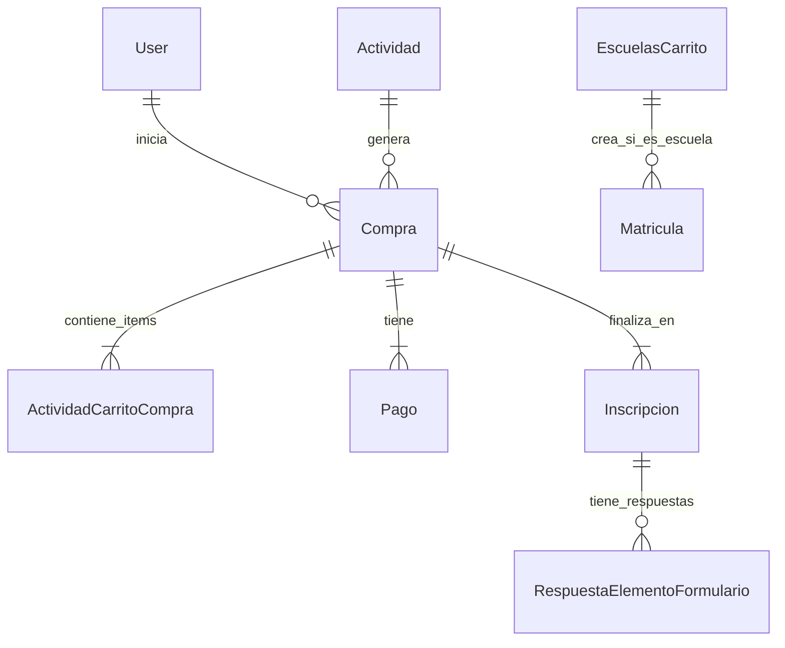

# Contexto del Módulo: Actividades-Carrito (Carrito de Compras)

## 1. Visión General

Este módulo (`app/Livewire/Carrito`) es el motor transaccional del sistema. Actúa como el puente entre el catálogo de **Actividades** y la generación de registros de **Inscripción** y **Matrícula**.

No es un carrito genérico; tiene tres comportamientos especializados según el `TipoActividad`:

1.  **Tienda Virtual (Estándar)**: Para conferencias, retiros y eventos generales.
2.  **Matrícula Académica (Escuelas)**: Para inscribirse en materias/niveles de crecimiento.
3.  **Abonos**: Para pagos parciales de eventos costosos.

## 2. Componentes Principales

### 2.1 `Carrito.php` (Tienda Estándar)

- **Vista**: `resources/views/livewire/carrito/carrito.blade.php`
- **Caso de Uso**: El usuario compra entradas para un evento (ej. "Congreso 2026").
- **Flujo**:
  1.  **Selección**: El usuario elige cantidades de `ActividadCategoria` (ej. "Entrada General", "VIP").
      - _Lógica_: `agregarAlCarrito()` valida el aforo y límites por usuario.
      - _Invitados_: Permite `cantidadInvitados` si la actividad lo soporta, creando inscripciones anónimas asociadas.
  2.  **Formulario**: (`RespuestaElementoFormulario`) Si la actividad pide datos extra (talla de camiseta, alergias), se recogen aquí.
  3.  **Checkout**: Redirige a `Checkout.php`.

### 2.2 `EscuelasCarrito.php` (Matrícula Académica)

- **Vista**: `resources/views/livewire/carrito/escuelas-carrito.blade.php`
- **Caso de Uso**: Estudiante se inscribe a "Nivel 1" o "Teología Básica".
- **Diferencias Clave**:
  - **Validación Estricta**: Usa `ValidadorEscuelas` para asegurar que el estudiante aprobó niveles previos.
  - **Selección Jerárquica**:
    - Elige `Materia` -> Elige `Sede` -> Elige `Horario` (HorarioMateriaPeriodo).
  - **Persistencia**: Al finalizar, crea una `Matricula` académica además de la `Inscripcion` y la `Compra`.

### 2.3 `AbonoCarrito.php` (Pagos Parciales)

- **Vista**: `resources/views/livewire/carrito/abono-carrito.blade.php`
- **Caso de Uso**: Usuario paga cuotas para un campamento.
- **Lógica**:
  - Valida montos mínimos (`valorMinimoAbonoParaCategoria`) y máximos (costo total - pagado).
  - Genera `Pagos` adicionales asociados a la misma `Compra` original.

### 2.4 `Checkout.php` (Pasarela Unificada)

- **Vista**: `resources/views/livewire/carrito/checkout.blade.php`
- **Función**: Punto de convergencia. Recibe una `Compra` (creada por cualquiera de los carritos anteriores).
- **Proceso**:
  1.  Selecciona método de pago (`TipoPago`).
  2.  Si es online (ZonaPagos), redirige a la pasarela.
  3.  Actualiza estado de `Pago` e `Inscripcion`.

## 3. Relación con Base de Datos

## 4. Puntos Críticos de Mantenimiento

- **Validación de Aforo**: Ocurre en tiempo real en `procesarRegistro()` (`Carrito.php`) para evitar sobreventas.
- **Persistencia de Matricula**: En `EscuelasCarrito.php`, es vital que `escuela_id` se propague correctamente desde el `Periodo` al registro de `Matricula`.
- **Estados de Pago**: `Checkout.php` actualiza el estado inicial antes de ir a la pasarela. Si esto falla, el webhook de ZonaPagos podría no encontrar la transacción correcta.
