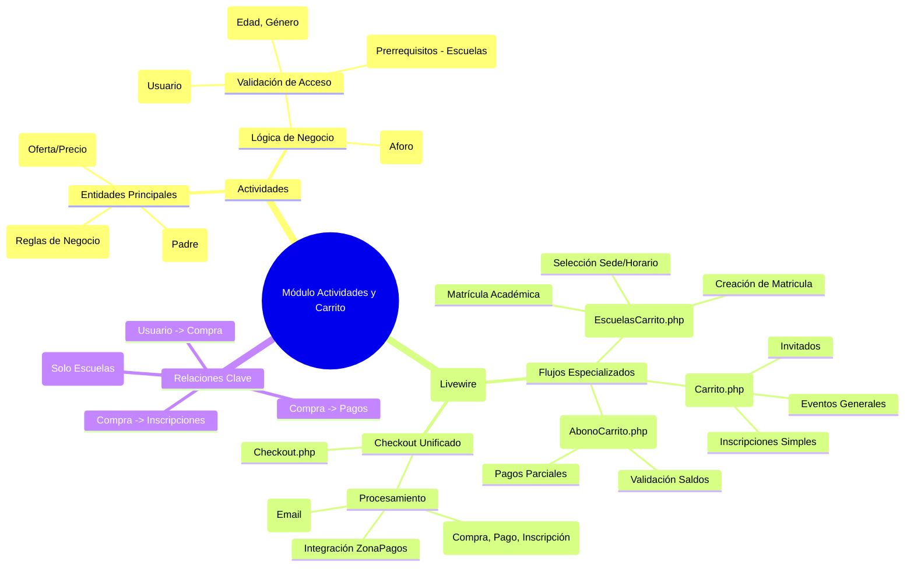

# Mapa Mental: Arquitectura de Actividades y Carrito

```mermaid
mindmap
  root((Módulo Actividades y Carrito))
    Actividades
      Entidades Principales
        Actividad (Padre)
        ActividadCategoria (Oferta/Precio)
        TipoActividad (Reglas de Negocio)
      Lógica de Negocio
        Validación de Acceso
          Global (Usuario)
          Por Categoría (Edad, Género)
          Académica (Prerrequisitos - Escuelas)
        Gestión de Cupos (Aforo)
    Carrito de Compras (Livewire)
      Flujos Especializados
        Estándar (Carrito.php)
          Eventos Generales
          Inscripciones Simples
          Invitados
        Escuelas (EscuelasCarrito.php)
          Matrícula Académica
          Selección Sede/Horario
          Creación de Matricula
        Abonos (AbonoCarrito.php)
          Pagos Parciales
          Validación Saldos
      Checkout Unificado
        Checkout.php
        Procesamiento
          Transacción DB (Compra, Pago, Inscripción)
          Integración ZonaPagos
          Notificaciones (Email)
    Relaciones Clave
      Usuario -> Compra
      Compra -> Pagos
      Compra -> Inscripciones
      Inscripción -> Matricula (Solo Escuelas)
```
