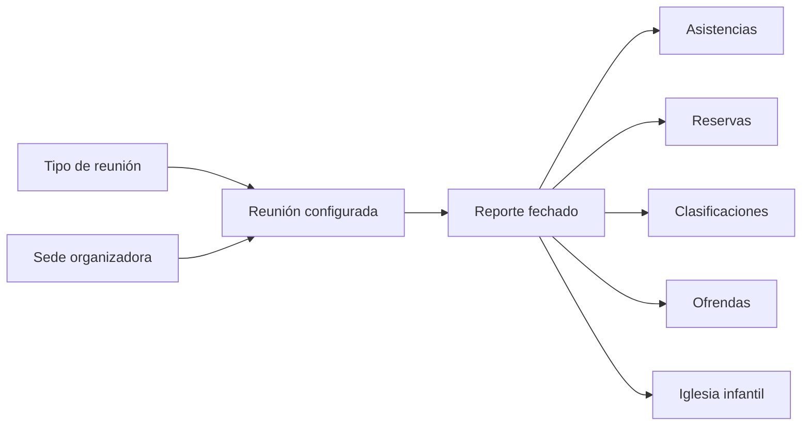

# Plan de desarrollo: Dashboard de reportes de reunión

## 1. Propósito del documento

Este documento define el orden recomendado para estabilizar los módulos de **Reuniones** y **Reportes de reunión**, preparar sus datos y construir un dashboard estadístico confiable.

El alcance de este documento es exclusivamente de **análisis y planificación**. No incluye implementación de código, migraciones ejecutadas ni cambios funcionales.

## 2. Objetivo funcional

Construir un dashboard multi-tenant en el que un usuario autorizado pueda:

- Seleccionar un rango de fechas inclusivo, por ejemplo del 1 de enero al 30 de junio.
- Filtrar por uno o varios tipos de reunión.
- Filtrar por una o varias reuniones concretas, por ejemplo domingo, sábado o miércoles.
- Filtrar por una o varias sedes.
- Ver una consolidación general cuando no se seleccione una reunión específica.
- Comparar resultados por reunión dentro del mismo período.
- Ver el mismo resumen separado por sede.
- Analizar asistencia por tipo de usuario, género y sede de pertenencia.
- Diferenciar asistencias acumuladas de personas únicas.
- Medir el promedio de asistentes por reporte.
- Medir la cobertura de la congregación mediante un porcentaje bien definido.
- Exportar a Excel el bloque general, cada bloque de sede o un libro completo.
- Aplicar las mismas reglas, filtros y permisos tanto en pantalla como en las exportaciones.

## 3. Modelo conceptual que debe conservarse

Los tres conceptos centrales no deben mezclarse:

| Concepto | Significado | Ejemplo |
|---|---|---|
| Tipo de reunión | Categoría funcional | Culto general, jóvenes, oración |
| Reunión | Plantilla recurrente de configuración | Culto del domingo, culto del sábado |
| Reporte de reunión | Ocurrencia fechada de una reunión | Culto del domingo del 15 de marzo |

La jerarquía objetivo es:

En la estructura actual, `TipoServicioReporteReunion` existe, pero no está relacionado con `Reunion` ni con `ReporteReunion`. Esa relación debe completarse antes de ofrecer el filtro por tipo.

## 4. Estado actual relevante

### 4.1 Elementos aprovechables

- `Reunion` ya representa la configuración reutilizable de un servicio.
- `ReporteReunion` ya identifica una ocurrencia mediante `reunion_id` y `fecha`.
- La reunión ya tiene una sede organizadora mediante `sede_id`.
- Los usuarios ya tienen `tipo_usuario_id`, `genero` y `sede_id`.
- Existen registros de reservas, asistencias, clasificaciones, ofrendas e Iglesia Infantil asociados directa o indirectamente al reporte.
- El proyecto ya utiliza dashboards con filtros mediante parámetros GET.
- El proyecto ya utiliza `maatwebsite/excel` y posee exportaciones con encabezados, porcentajes y totales.

### 4.2 Vacíos que impiden estadísticas confiables

- Un reporte funciona simultáneamente como programación futura y como reporte diligenciado; no existe un estado inequívoco que permita excluir borradores, reuniones futuras o reportes cancelados.
- La tabla `asistencia_reuniones` no coincide con los campos que espera la relación del modelo.
- La asistencia de usuarios registrados y la asistencia de invitados se almacena en estructuras distintas.
- Hay contadores manuales como `cantidad_asistencias`, `aforo_ocupado`, `invitados` y `total_ofrendas` que pueden desviarse de los registros reales.
- No existen restricciones suficientes para impedir duplicados de asistencia o reserva.
- Los atributos actuales del usuario pueden cambiar después del reporte; por ello, consultar hoy su tipo, género o sede puede reescribir estadísticamente el pasado.
- Los invitados externos no tienen todos los datos demográficos necesarios para clasificarlos por género o sede.
- El porcentaje de congregación no tiene un denominador histórico definido.
- El tipo de reunión está creado como catálogo, pero desconectado del módulo.
- La configuración de una reunión se copia solo parcialmente al reporte. Parte del histórico depende todavía de la configuración actual de la reunión.
- No hay pruebas automatizadas específicas para reuniones, reservas, asistencias o estadísticas.

## 5. Decisiones de negocio obligatorias antes de programar

Estas decisiones deben aprobarse y quedar escritas. Sin ellas se pueden producir cifras técnicamente correctas, pero conceptualmente equivocadas.

### 5.1 Qué se considera un reporte válido

Recomendación:

- Incorporar un ciclo de estado explícito: `programado`, `en_curso`, `finalizado` y `cancelado`.
- El dashboard debe incluir por defecto únicamente reportes `finalizados`.
- Los reportes programados, borradores o cancelados no deben afectar promedios.
- El filtro de estado puede existir para administradores, pero nunca debe mezclar silenciosamente estados diferentes.

### 5.2 Qué significa “porcentaje de la congregación”

Recomendación:

- Definir la **población elegible** de cada reporte: usuarios activos que, en la fecha del reporte, pertenecían a las sedes, tipos de usuario, géneros y rangos de edad habilitados para esa reunión.
- Guardar esa población como una fotografía histórica del reporte.
- Calcular la cobertura con asistentes registrados elegibles; los invitados externos deben mostrarse aparte para evitar porcentajes superiores al 100 %.
- Para períodos con varias reuniones, usar una cobertura ponderada:

  `asistencias registradas elegibles acumuladas / población elegible acumulada de los reportes`.

No se recomienda dividir el promedio de asistencia entre la cantidad actual de usuarios de la iglesia, porque el porcentaje histórico cambiaría cuando ingresen, se retiren o cambien de sede los miembros.

### 5.3 Qué significa “sede”

El dashboard debe distinguir dos dimensiones:

- **Sede organizadora:** sede de la reunión; será la base de los bloques individuales por sede.
- **Sede de pertenencia:** sede del usuario asistente; servirá para analizar de dónde proviene la asistencia.

El filtro principal de sede debe usar la sede organizadora. El desglose de procedencia podrá usar la sede de pertenencia.

### 5.4 Qué se considera una asistencia

Recomendación:

- Usuario registrado: una persona con un único registro confirmado de asistencia por reporte.
- Invitado externo: una reserva de invitado marcada como efectivamente registrada.
- Conteo manual o preliminar: indicador operativo, no asistencia nominal, salvo que se cree un mecanismo explícito para registrar asistentes anónimos.
- Clasificaciones adicionales: no deben sumarse automáticamente a la asistencia si pueden representar personas ya contabilizadas.

Debe eliminarse cualquier posibilidad de sumar a una misma persona mediante dos fuentes.

### 5.5 Alcance de usuario general y administrador

Recomendación inicial:

- Administrador autorizado: todas las sedes y todas las reuniones del tenant.
- Usuario general autorizado: solamente su sede o el alcance configurado en su rol.
- Ambos pueden ver agregados si poseen el permiso correspondiente.
- La exportación y la visualización financiera requieren permisos separados.
- Los datos personales detallados nunca deben estar disponibles por el solo hecho de poder ver estadísticas agregadas.

### 5.6 Datos históricos y cambios de perfil

Recomendación:

- Congelar en el momento de la asistencia el tipo de usuario, género y sede de pertenencia usados para estadística.
- Congelar en el reporte el tipo de reunión, la sede organizadora y las reglas que determinan la población elegible.
- Para reportes anteriores a este cambio, marcarlos como datos históricos reconstruidos y documentar su nivel de confianza.

## 6. Diseño funcional del dashboard

### 6.1 Barra global de filtros

Filtros principales:

1. Fecha inicial.
2. Fecha final.
3. Tipos de reunión, con selección múltiple.
4. Reuniones, con selección múltiple y opciones dependientes de los tipos seleccionados.
5. Sedes organizadoras, con selección múltiple.
6. Estado del reporte; por defecto, `finalizado`.

Filtros analíticos opcionales:

- Tipo de usuario.
- Género.
- Sede de pertenencia del asistente.
- Incluir o excluir invitados externos.

Comportamiento esperado:

- Las fechas son inclusivas y se interpretan en la zona horaria del tenant.
- Si no se elige tipo, reunión o sede, se incluyen todos los valores autorizados.
- Elegir un tipo limita el catálogo de reuniones disponible.
- Elegir una reunión limita las sedes a las que realmente pertenece.
- Los filtros aplicados deben permanecer en la URL para poder recargar, compartir o exportar el mismo contexto.
- Deben existir acciones claras para `Aplicar`, `Limpiar` y `Exportar`.
- La pantalla debe mostrar chips o un resumen textual de los filtros activos.

### 6.2 Bloque general

Indicadores principales:

- Reportes finalizados incluidos.
- Asistencias acumuladas.
- Personas registradas únicas en el período.
- Promedio de asistentes por reporte.
- Cobertura congregacional ponderada.
- Invitados externos confirmados.
- Reservas realizadas y porcentaje de conversión a asistencia.
- Ocupación promedio frente al aforo, cuando exista aforo definido.

Visualizaciones recomendadas:

- Tendencia temporal de asistencia total, registrados e invitados.
- Tabla comparativa por reunión.
- Distribución por tipo de usuario.
- Distribución por género.
- Procedencia por sede de pertenencia.

La tabla por reunión debe contener, como mínimo:

| Reunión | Tipo | Sede | Reportes | Asistencias | Promedio/reporte | Personas únicas | Cobertura | Invitados |
|---|---|---|---:|---:|---:|---:|---:|---:|

Si no se selecciona una reunión, el bloque general combina todas las reuniones autorizadas y luego muestra cada reunión como una fila comparativa.

### 6.3 Bloques por sede organizadora

Después del bloque general se debe presentar un bloque por cada sede incluida en los filtros.

Cada bloque de sede debe incluir:

- Los mismos KPI esenciales del bloque general, limitados a esa sede.
- Una tabla con una fila por reunión de la sede.
- El promedio por reporte de cada reunión.
- La cobertura congregacional de cada reunión.
- Distribución por tipo de usuario y género.
- Botón de exportación exclusivo para esa sede.

Ejemplo conceptual:

- Bogotá
  - Miércoles: promedio, total, cobertura y composición.
  - Sábado: promedio, total, cobertura y composición.
  - Domingo: promedio, total, cobertura y composición.
- Medellín
  - Las mismas métricas para sus reuniones.

Los bloques pueden ser plegables para evitar una página excesivamente larga, pero sus cifras deben cargarse de forma eficiente y conservar los filtros globales.

### 6.4 Bloques secundarios del reporte

El núcleo de la primera versión debe ser asistencia. Después de validar ese núcleo se pueden añadir, sin mezclar permisos ni fórmulas:

- Clasificaciones de asistentes.
- Reservas, cancelaciones, no presentación y uso del aforo.
- Iglesia Infantil y preregistros.
- Visualizaciones de transmisión.
- Ofrendas por tipo y promedio por reporte.

El bloque financiero debe ser independiente y visible solo con permiso. Sus cifras deben calcularse desde las transacciones reales de `Ofrenda` e `Ingreso`, no desde `total_ofrendas` mientras ese contador no haya sido reconciliado.

### 6.5 Mensajes de calidad de datos

El dashboard debe advertir, sin bloquear toda la pantalla, cuando encuentre:

- Reportes sin finalizar.
- Reportes finalizados sin asistencias registradas.
- Diferencias entre contadores almacenados y registros reales.
- Asistencias duplicadas.
- Asistentes sin género, tipo de usuario o sede.
- Reportes históricos sin fotografía de población elegible.

## 7. Contrato de métricas

Todas las métricas deben tener una definición única reutilizada por la pantalla y por Excel.

| Métrica | Definición recomendada |
|---|---|
| Reportes incluidos | Cantidad distinta de reportes finalizados que cumplen los filtros |
| Asistencias registradas | Suma de usuarios con asistencia confirmada, una vez por reporte |
| Invitados externos | Suma de invitados externos con ingreso confirmado |
| Asistencias acumuladas | Registrados confirmados + invitados externos confirmados + anónimos válidos, sin duplicados |
| Personas únicas | Usuarios distintos que asistieron al menos una vez; invitados sin identidad no se deduplican |
| Promedio por reporte | Asistencias acumuladas / reportes incluidos |
| Cobertura congregacional | Asistencias registradas elegibles / población elegible acumulada |
| Conversión de reserva | Personas reservadas que asistieron / personas reservadas |
| Ocupación de aforo | Asistencias acumuladas / aforo acumulado de reportes con aforo |
| Participación por tipo de usuario | Asistencias registradas del tipo / asistencias registradas con tipo conocido |
| Participación por género | Asistencias del género / asistencias con género conocido |

Reglas transversales:

- Evitar divisiones por cero; mostrar `Sin base` en lugar de un porcentaje engañoso.
- Mostrar cantidades y porcentajes juntos.
- Informar los valores `Sin clasificar` o `Sin dato`; no ocultarlos.
- Redondear solo para presentación, no durante la agregación.
- No promediar promedios simples cuando los reportes tienen denominadores diferentes.
- Usar los límites exactos del rango de fechas seleccionado; no ampliar automáticamente a semanas completas.

## 8. Cambios de datos y dominio previstos

### 8.1 Conectar tipos de reunión

- Relacionar el catálogo `tipo_servicios_reporte_reunion` con `reuniones`.
- Añadir relaciones Eloquent en ambos sentidos.
- Permitir seleccionar el tipo al crear o editar una reunión.
- Definir si el tipo es obligatorio; se recomienda que lo sea para nuevas reuniones.
- Congelar el tipo en el reporte o garantizar su trazabilidad histórica.
- Preparar una asignación manual o migración de datos para reuniones existentes.

### 8.2 Formalizar el estado del reporte

- Añadir el estado del ciclo de vida.
- Definir quién puede finalizar, reabrir o cancelar.
- Registrar autor y fecha de finalización.
- Impedir que reportes no finalizados afecten estadísticas oficiales.

### 8.3 Unificar el hecho de asistencia

- Corregir la diferencia entre el esquema real de `asistencia_reuniones` y los campos esperados por el modelo.
- Establecer una fuente canónica de asistencia.
- Añadir unicidad por reporte y usuario.
- Conservar la trazabilidad del autor y del momento del registro.
- Incorporar los atributos históricos necesarios para los desgloses.
- Definir un tratamiento explícito para invitados externos y asistentes anónimos.
- Recalcular los contadores derivados desde la fuente canónica o dejar de persistirlos si no son necesarios.

### 8.4 Fotografías históricas

Cada reporte finalizado debe conservar:

- Tipo de reunión.
- Sede organizadora.
- Aforo aplicable.
- Restricciones de elegibilidad.
- Población elegible total.
- Cuando se necesite auditoría detallada, población elegible por tipo de usuario, género y sede.

Cada asistencia registrada debe conservar las dimensiones demográficas utilizadas en el momento del reporte.

### 8.5 Integridad referencial e índices

Revisar y añadir, según corresponda:

- Claves foráneas y reglas de borrado para reunión, reporte, asistencia y reserva.
- Unicidad de asistencia por usuario y reporte.
- Unicidad de reserva de un mismo usuario cuando la regla de negocio lo exija.
- Índice compuesto de reportes por fecha y reunión.
- Índices de reunión por tipo y sede.
- Índices de asistencias y reservas por reporte.
- Índices para género, tipo de usuario y sede solo si los planes de consulta de PostgreSQL muestran que son útiles.

## 9. Arquitectura de aplicación recomendada

No se debe concentrar toda la lógica en `ReporteReunionController`.

Separación propuesta:

- **Validador de filtros:** normaliza fechas, arreglos de identificadores y alcance autorizado.
- **Objeto de criterios:** representa el conjunto inmutable de filtros aplicados.
- **Servicio de estadísticas:** produce el bloque general, el desglose por reunión y los bloques por sede.
- **Consultas agregadas:** resuelven cada familia de métricas con SQL compatible con PostgreSQL y sin ciclos N+1.
- **Controlador del dashboard:** autoriza, recibe filtros y entrega el resultado a la vista.
- **Presentación:** Blade o Livewire 3, según el nivel de interacción que finalmente se elija.
- **Exportadores:** consumen exactamente el mismo objeto de criterios y los mismos resultados estadísticos.

Esta separación permite verificar fórmulas una sola vez y evita duplicar el cálculo entre dashboard, detalle y Excel.

## 10. Permisos y privacidad

Crear permisos separados para:

- Ver el dashboard.
- Ver todas las sedes.
- Ver solamente una sede asignada.
- Exportar agregados.
- Ver detalle nominal de asistentes.
- Exportar detalle nominal.
- Ver estadísticas financieras.
- Exportar estadísticas financieras.

Controles obligatorios:

- Autorizar del lado del servidor cada ruta de dashboard y exportación.
- Aplicar el alcance de sede antes de ejecutar las consultas, no después de obtener datos.
- Mantener el aislamiento del tenant en consultas, caché y archivos exportados.
- No incluir nombres, correos o teléfonos en exportaciones agregadas.
- Registrar en auditoría quién exportó, qué alcance utilizó y cuándo lo hizo si el archivo contiene datos personales.

## 11. Diseño de exportaciones Excel

### 11.1 Exportación completa

Un libro completo debería contener hojas separadas:

1. `Resumen general`.
2. `Por reunión`.
3. `Por sede`.
4. `Tipos de usuario`.
5. `Género`.
6. `Tendencia`.
7. `Calidad de datos`, si existen advertencias.
8. `Detalle`, solamente si el usuario tiene el permiso nominal.

### 11.2 Exportación de un bloque

- El bloque general exporta únicamente el resumen general y sus desgloses.
- Cada bloque de sede exporta el resumen de esa sede y sus reuniones.
- Un bloque demográfico puede exportar su tabla específica sin generar el libro completo.

### 11.3 Reglas de consistencia

- La exportación debe repetir todos los filtros activos en su encabezado.
- Debe incluir tenant, zona horaria y fecha de generación.
- Los porcentajes deben ser celdas numéricas con formato de porcentaje, no texto.
- Los totales y promedios deben coincidir exactamente con la pantalla.
- El nombre del archivo debe incluir alcance y fechas.
- Los rangos pequeños pueden descargarse en la petición actual.
- Los rangos grandes deben procesarse en cola, almacenarse temporalmente en el disco del tenant y notificarse al usuario autorizado.

## 12. Plan de ejecución por fases

### Fase 0 — Cerrar definiciones y preparar una línea base

- [ ] Aprobar el glosario: tipo, reunión, reporte y sede.
- [ ] Aprobar qué estados cuentan como reporte oficial.
- [ ] Aprobar la fórmula de cobertura congregacional.
- [ ] Aprobar quiénes forman la población elegible.
- [ ] Aprobar el alcance del usuario general frente al administrador.
- [ ] Decidir si los invitados requieren género y sede de procedencia.
- [ ] Inventariar cantidad de reuniones, reportes, asistencias, reservas y duplicados existentes.
- [ ] Comparar una muestra manual de reportes con los registros de base de datos.
- [ ] Crear un conjunto de casos de referencia con resultados esperados.

**Salida:** documento de reglas firmado y reporte de calidad inicial.

### Fase 1 — Corregir riesgos críticos del módulo actual

- [ ] Restaurar la edición de reportes, actualmente detenida por una respuesta temporal.
- [ ] Corregir el middleware de verificación de reuniones para que siempre continúe o redirija explícitamente.
- [ ] Completar las vistas Livewire vacías de asistentes, reservas e ingresos.
- [ ] Aplicar autorización del lado del servidor a reuniones, reportes, ingresos y exportaciones.
- [ ] Proteger las rutas públicas de reserva, resumen, QR y eliminación contra acceso por identificadores predecibles.
- [ ] Separar correctamente el flujo de auto-reserva del usuario del flujo administrativo.
- [ ] Corregir concurrencia, límites familiares, duplicados y validación de parentesco en las reservas.

**Salida:** módulo base operable y seguro. No iniciar estadísticas oficiales antes de este punto.

### Fase 2 — Establecer la fuente canónica de datos

- [ ] Alinear la tabla de asistencias con el modelo y el comportamiento real.
- [ ] Definir cómo se representan usuarios, invitados y anónimos.
- [ ] Añadir restricciones de unicidad y claves foráneas.
- [ ] Ejecutar escrituras relacionadas dentro de transacciones.
- [ ] Reconciliar `cantidad_asistencias`, `aforo_ocupado`, `invitados` y `total_ofrendas` con sus registros fuente.
- [ ] Corregir la eliminación de reportes y sus dependencias.
- [ ] Corregir tablas pivote duplicadas o desconectadas de edades, géneros y tipos de asistentes.
- [ ] Corregir consultas específicas de MySQL para que funcionen en PostgreSQL.
- [ ] Preparar una estrategia de limpieza y respaldo antes de modificar datos históricos.

**Salida:** una fuente única y auditable para cada métrica.

### Fase 3 — Completar el modelo analítico

- [ ] Conectar tipos de reunión con reuniones.
- [ ] Asignar tipos a las reuniones existentes.
- [ ] Incorporar el estado del reporte.
- [ ] Definir y capturar la fecha de finalización.
- [ ] Capturar la fotografía de la reunión y su población elegible.
- [ ] Capturar las dimensiones históricas del asistente.
- [ ] Añadir los índices necesarios.
- [ ] Definir cómo se tratarán los reportes antiguos sin fotografía histórica.

**Salida:** datos suficientes para filtros, promedios y porcentajes reproducibles.

### Fase 4 — Construir el motor estadístico

- [ ] Crear y validar el objeto de filtros.
- [ ] Aplicar permisos y alcance de sede en el origen de las consultas.
- [ ] Implementar el contrato de métricas con consultas agregadas.
- [ ] Producir una respuesta estructurada para general, reuniones y sedes.
- [ ] Añadir tendencias temporales y composiciones demográficas.
- [ ] Detectar y devolver alertas de calidad de datos.
- [ ] Comparar los resultados con los casos de referencia de la Fase 0.

**Salida:** servicio estadístico independiente de la interfaz.

### Fase 5 — Construir la interfaz del dashboard

- [ ] Crear la ruta y navegación con permiso.
- [ ] Implementar la barra de filtros globales.
- [ ] Implementar KPI y tendencia general.
- [ ] Implementar tabla comparativa por reunión.
- [ ] Implementar composición por tipo de usuario y género.
- [ ] Implementar procedencia por sede de pertenencia.
- [ ] Implementar bloques plegables por sede organizadora.
- [ ] Añadir estados de carga, sin resultados y error.
- [ ] Añadir mensajes de calidad de datos.
- [ ] Verificar funcionamiento responsive y accesible.

**Salida:** dashboard navegable y coherente con el diseño del sistema.

### Fase 6 — Implementar exportaciones

- [ ] Exportación completa con varias hojas.
- [ ] Exportación del bloque general.
- [ ] Exportación individual de cada sede.
- [ ] Exportaciones demográficas.
- [ ] Permisos separados para agregados y detalle nominal.
- [ ] Procesamiento en cola para exportaciones grandes.
- [ ] Prueba automática de equivalencia entre pantalla y archivo.

**Salida:** archivos Excel reproducibles, filtrados y autorizados.

### Fase 7 — Rendimiento y operación

- [ ] Medir consultas con volúmenes reales de varios años.
- [ ] Eliminar N+1 y agregaciones realizadas en PHP cuando deban resolverse en PostgreSQL.
- [ ] Revisar planes de ejecución e índices.
- [ ] Añadir caché por tenant y filtros normalizados si las mediciones lo justifican.
- [ ] Invalidar la caché al crear, editar, finalizar o eliminar datos relacionados.
- [ ] Establecer límites de rango o ejecución asíncrona para consultas muy grandes.
- [ ] Observar tiempos, errores y uso de memoria en producción.

**Salida:** tiempos de respuesta aceptables y operación observable.

### Fase 8 — Pruebas, migración y despliegue gradual

- [ ] Pruebas unitarias de fórmulas.
- [ ] Pruebas de filtros individuales y combinados.
- [ ] Pruebas de permisos y alcance por sede.
- [ ] Pruebas de aislamiento entre tenants.
- [ ] Pruebas de duplicados, datos faltantes y división por cero.
- [ ] Pruebas de reportes programados, finalizados y cancelados.
- [ ] Pruebas de usuarios que cambian de sede, género o tipo después del reporte.
- [ ] Pruebas de Excel y equivalencia con pantalla.
- [ ] Respaldo y migración de datos históricos.
- [ ] Despliegue inicialmente para administradores seleccionados.
- [ ] Reconciliación manual de una muestra por sede.
- [ ] Habilitación posterior para usuarios generales autorizados.

**Salida:** dashboard validado con datos reales antes de ampliar el acceso.

### Fase 9 — Extensiones posteriores

- [ ] Comparación entre dos períodos.
- [ ] Metas de asistencia por reunión o sede.
- [ ] Variación porcentual frente al período anterior.
- [ ] Clasificaciones de asistentes.
- [ ] Iglesia Infantil.
- [ ] Transmisiones y visualizaciones.
- [ ] Estadísticas financieras con permiso independiente.
- [ ] Programación y envío periódico de reportes.

## 13. Mapa de componentes que probablemente se alterarán

| Área | Elementos actuales a revisar | Cambio esperado |
|---|---|---|
| Dominio | `Reunion`, `ReporteReunion`, `ReservaReunion`, `TipoServicioReporteReunion` | Relaciones, estados, snapshots y contratos claros |
| Base de datos | Tablas de reuniones, reportes, asistencias, reservas y tipos | Integridad, campos históricos, índices y migración de datos |
| Seguridad | Rutas y métodos de reuniones/reportes | Permisos de servidor, alcance por sede y protección pública |
| Reservas | Controladores y componentes Livewire | Transacciones, concurrencia, familiares e invitados |
| Estadísticas | Actualmente no existe una capa dedicada | Servicio de filtros, agregación y alertas |
| Interfaz | Vistas de reuniones/reportes y navegación | Nueva pantalla de dashboard y filtros |
| Exportación | Exportadores individuales de reservas/asistencias | Exportación consolidada y por bloques con fórmulas compartidas |
| Pruebas | Sin cobertura específica suficiente | Casos de negocio, permisos, tenants, métricas y Excel |
| Documentación | Workflows y memoria técnica | Actualizar arquitectura y reglas cuando la implementación termine |

Los nombres exactos de clases nuevas deben decidirse al iniciar la implementación, respetando las convenciones existentes y evitando aumentar todavía más el tamaño de `ReporteReunionController`.

## 14. Criterios de aceptación principales

El dashboard estará listo cuando se pueda demostrar que:

1. El rango de fechas incluye exactamente los extremos seleccionados.
2. Los filtros de tipo, reunión y sede funcionan solos y combinados.
3. Sin reunión seleccionada, el general consolida todas las reuniones autorizadas.
4. La suma y el promedio general se explican mediante los reportes incluidos.
5. Cada reunión muestra total, promedio y cobertura con el mismo contrato.
6. Cada sede reproduce las métricas usando solamente sus reuniones.
7. Tipos de usuario, géneros y sedes de pertenencia suman correctamente, incluyendo `Sin dato`.
8. Un usuario no puede ver ni exportar sedes fuera de su alcance.
9. Los reportes futuros, borradores y cancelados no alteran el resultado oficial.
10. Una persona no se cuenta dos veces en el mismo reporte.
11. Los invitados no inflan la cobertura congregacional.
12. Los cambios posteriores del perfil no modifican el histórico congelado.
13. Excel coincide exactamente con la pantalla para los mismos filtros.
14. No existe fuga de datos entre tenants.
15. Los resultados se mantienen dentro del objetivo de rendimiento acordado con datos reales.

## 15. Orden resumido recomendado

1. Definir las métricas y el alcance de acceso.
2. Reparar seguridad y fallos críticos del módulo existente.
3. Unificar asistencia, reservas y contadores.
4. Conectar tipos de reunión y formalizar estados.
5. Crear fotografías históricas y población elegible.
6. Construir y probar el motor estadístico.
7. Crear el dashboard general y por sede.
8. Añadir exportaciones desde el mismo motor.
9. Optimizar, migrar datos y desplegar gradualmente.
10. Incorporar estadísticas secundarias cuando la asistencia sea confiable.

## 16. Definición de terminado

La funcionalidad no debe considerarse terminada solo porque muestre gráficos. Debe contar con datos reconciliados, fórmulas documentadas, permisos de servidor, aislamiento multi-tenant, exportaciones equivalentes, pruebas automatizadas y validación manual con al menos una muestra real por sede.
