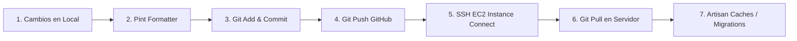

# Protocolo de Despliegue Git y Servidor EC2 — Agente Git

Este documento establece las instrucciones, comandos y directrices operativas para que el agente o el desarrollador ejecuten el ciclo completo de versionamiento y despliegue continuo: **Local (Mac) $\rightarrow$ Repositorio GitHub $\rightarrow$ Servidor AWS EC2**.

---

## 1. Parámetros del Entorno

| Parámetro | Valor |
|---|---|
| **Instancia AWS EC2** | `i-0a846e8fb50d9a003` |
| **Usuario SSH Remoto** | `ubuntu` |
| **Región AWS** | `us-east-1` |
| **Directorio en Servidor** | `/var/www/html/redil-cloud` |
| **Repositorio Remoto** | `https://github.com/IDEA-ARRIBA-REDIL/redil-cloud.git` |
| **Rama de Producción/Pruebas** | `main` |
| **Mecanismo de Conexión** | AWS EC2 Instance Connect (`aws ec2-instance-connect ssh`) |

---

## 2. Flujo de Trabajo Paso a Paso

El proceso consta de 3 fases obligatorias: **Local**, **GitHub**, y **Servidor Remoto**.



---

### Fase 1: Local (Preparación y Verificación)

1. **Revisar archivos modificados**:
   ```bash
   git status -s
   ```
2. **Formatear código PHP con Laravel Pint**:
   ```bash
   vendor/bin/pint --dirty --format agent
   ```
3. **Verificar el diff específico de los archivos a subir**:
   ```bash
   git diff path/al/archivo1.php path/al/archivo2.blade.php
   ```

---

### Fase 2: Git Local $\rightarrow$ GitHub

> [!WARNING]
> Nunca uses `git add .` a ciegas si existen archivos de trabajo en curso o documentación temporal no relacionada. Agrega puntualmente los archivos del cambio.

1. **Agregar los archivos al área de preparación (Stage)**:
   ```bash
   git add <archivo1> <archivo2> <migracion>
   ```

2. **Crear el commit con mensaje semántico**:
   ```bash
   git commit -m "tipo(modulo): breve descripcion del cambio"
   ```
   *Ejemplos:*
   - `fix(sedes): hacer opcional el campo grupo_id al crear y modificar sede`
   - `feat(actividades): agregar selector de novedades en perfil`

3. **Subir los cambios a GitHub**:
   ```bash
   git push origin main
   ```

---

### Fase 3: GitHub $\rightarrow$ Servidor EC2 (Despliegue)

Dado que la terminal del agente no interactúa mediante una sesión TTY interactiva, **los comandos remotos se envían canalizados (pipe `|`) directamente a `aws ec2-instance-connect ssh`**:

#### 1. Descargar los cambios con `git pull`:
```bash
echo "cd /var/www/html/redil-cloud && git pull origin main" | aws ec2-instance-connect ssh --instance-id i-0a846e8fb50d9a003 --os-user ubuntu
```

#### 2. Limpiar cachés de vistas y configuración de Laravel:
```bash
echo "cd /var/www/html/redil-cloud && php artisan view:clear && php artisan optimize:clear" | aws ec2-instance-connect ssh --instance-id i-0a846e8fb50d9a003 --os-user ubuntu
```

#### 3. Ejecutar Migraciones (Si aplica):
- **Migraciones centrales**:
  ```bash
  echo "cd /var/www/html/redil-cloud && php artisan migrate --force" | aws ec2-instance-connect ssh --instance-id i-0a846e8fb50d9a003 --os-user ubuntu
  ```
- **Migraciones de Tenants** *(ubicadas en `database/migrations/tenant`)*:
  ```bash
  echo "cd /var/www/html/redil-cloud && php artisan tenants:migrate" | aws ec2-instance-connect ssh --instance-id i-0a846e8fb50d9a003 --os-user ubuntu
  ```

---

## 3. Comandos de Diagnóstico Rápido en Servidor

Para inspeccionar el estado del servidor remoto sin entrar interactivamente:

- **Ver estado de Git en el servidor**:
  ```bash
  echo "cd /var/www/html/redil-cloud && git status -s && git log -1 --oneline" | aws ec2-instance-connect ssh --instance-id i-0a846e8fb50d9a003 --os-user ubuntu
  ```
- **Ver uso de disco y memoria**:
  ```bash
  echo "df -h / && free -m" | aws ec2-instance-connect ssh --instance-id i-0a846e8fb50d9a003 --os-user ubuntu
  ```
- **Ver últimos logs de Laravel en el servidor**:
  ```bash
  echo "tail -n 50 /var/www/html/redil-cloud/storage/logs/laravel.log" | aws ec2-instance-connect ssh --instance-id i-0a846e8fb50d9a003 --os-user ubuntu
  ```

---

## 4. Script One-Liner de Despliegue Rápido (Local $\rightarrow$ Server)

Cuando se hayan hecho commits y se quiera subir a GitHub y desplegar al servidor en un solo paso:

```bash
git push origin main && echo "cd /var/www/html/redil-cloud && git pull origin main && php artisan view:clear" | aws ec2-instance-connect ssh --instance-id i-0a846e8fb50d9a003 --os-user ubuntu
```

---

## 5. Reglas de Oro para el Agente

1. **Permisos de red en Antigravity**: Las llamadas a `aws ec2-instance-connect` y `git push` requieren acceso a internet y lectura de credenciales de AWS en `~/.aws`, por lo que deben ejecutarse con `BypassSandbox: true`.
2. **Modo No Interactivo**: No ejecutar comandos remotos que puedan pedir confirmación `[y/N]` o contraseñas. Siempre incluir flags como `--force` o `echo` para responder automáticamente.
3. **Manejo de Base de Datos**: Nunca ejecutar `php artisan migrate:fresh` o comandos destructivos en el servidor. Informar siempre al usuario antes o después de ejecutar `tenants:migrate`.
4. **Registro de Estado**: Tras cada despliegue significativo, actualizar [`_docs_agente/estado_actual.md`](file:///Users/macosxdarwin/Desktop/REDIL-CLOUD/_docs_agente/estado_actual.md).
